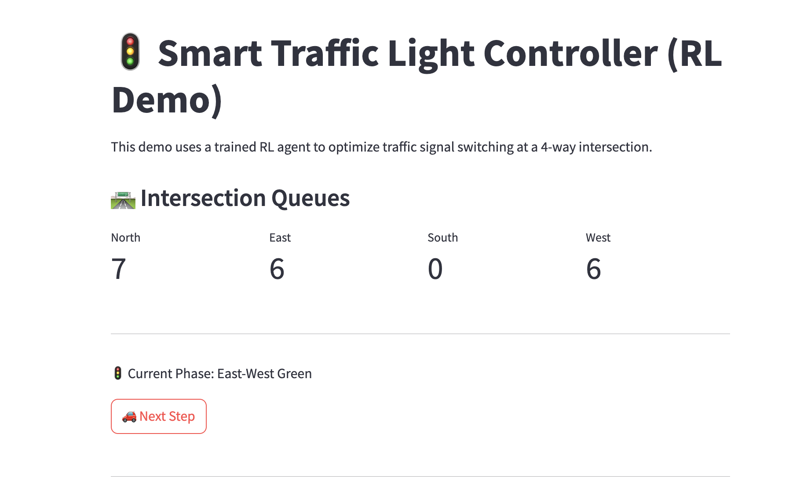
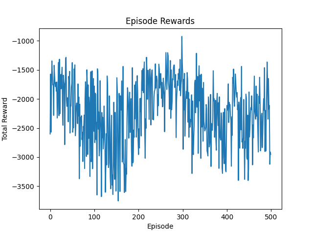
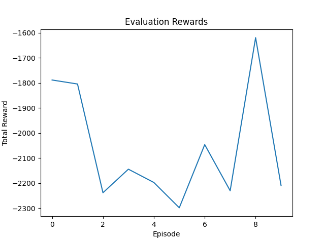

# Smart Traffic Light Controller (RL-Powered)

A reinforcement learning-based traffic light control system that uses a Deep Q-Network (DQN) to reduce congestion at a 4-way intersection. Built with PyTorch, OpenAI Gym, and Streamlit for visualization.

<p align="center">
  
</p>

---

## 🌐 Overview

Traditional traffic lights operate on fixed timers, which often leads to unnecessary waiting and congestion. This project simulates a smart traffic light controller that learns to **dynamically adjust light phases** based on queue lengths using Reinforcement Learning.

---

## 🧠 Project Highlights

- ✅ Custom Gym Environment (`TrafficLightEnv`)
- ✅ DQN Agent (PyTorch-based)
- ✅ Reward-driven learning (minimize queue lengths)
- ✅ Real-time Streamlit Dashboard
- ✅ Model evaluation & live demo
- ✅ No third-party traffic simulator required (lightweight)

---

## 📁 Project Structure
```python
smart-traffic-rl/ 
├── agents/ # DQN model 
├── app/ # Streamlit dashboard 
├── envs/ # Custom Gym environment 
├── models/ # Saved PyTorch model 
├── reports/ # PNG plots & demo screenshots 
├── train.py # Training loop 
├── evaluate.py # Evaluation loop 
├── requirements.txt 
└── README.md
```


---

## 🚦 How It Works

- Observation: Queue lengths from N/E/S/W directions
- Action: Select either NS-green or EW-green light phase
- Reward: Negative sum of all queue lengths (minimize total wait)
- Done: After 100 time steps per episode

---

## 📈 Training Performance

<p align="center">
  
  
</p>

---

## 🚀 Run It Locally

### 1. Install Dependencies

```bash
pip install -r requirements.txt
```

### 2.Train the Model
```
python train.py
```

### 3.Evaluate the Trained Agent
```
python evaluate.py
```

### 4.Launch the Streamlit Dashboard
```
streamlit run app/app.py
```

## Streamlit Demo Features
- Live queue values
- Visual green light phase
- RL-predicted phase switch
- Button to simulate next step
- Real-time reward tracking

## Future Enhancements
- Multi-intersection simulation
- TensorBoard logging
- Queue animation (matplotlib or GIF)
- Continuous training loop with curriculum

## License
This project is licensed under the MIT License.

## 👨‍💻 Author
**Raj Kumar Myakala**  
AI | Data | Automation | GCP | Python  
[LinkedIn ](https://www.linkedin.com/in/raj-kumar-myakala-927860264/)  
[GitHub ](https://github.com/rajkumar160798)

---

>  If you like this project, consider starring the repo and following my GitHub for more AI/ML innovations!
